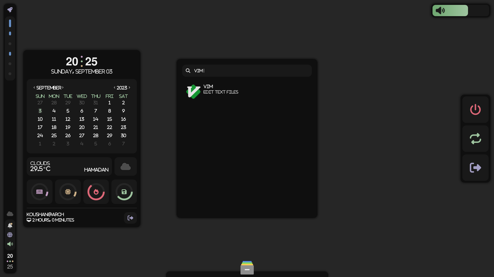

# M Koushan .dotfiles
my dotfiles for Arch Linux, based on [juminai dotfiles](https://github.com/juminai/dotfiles/tree/hyprland/)

# Contents
- [Requirements](#requirements)
- Installation
    - [Easy](#easy)
    - [Hard](#hard)
- [How to use](#how-to-use)
- [Screenshots](#screenshots)
- [License](#license)

## Requirements
* [Arch Linux](https://archlinux.org) - Operating system
* [Hyprland](https://wiki.archlinux.org/title/Hyprland) - Window manager
* [Dunst](https://wiki.archlinux.org/title/Dunst) - Notification daemon
* [Eww](https://elkowar.github.io/eww/) - Widgets
* [Foot](https://wiki.archlinux.org/title/Foot) - Terminal
* [Bash](https://wiki.archlinux.org/title/Bash) - Shell
* [Starship](https://starship.rs/) - Shell promt
* [Vim](https://wiki.archlinux.org/title/Vim) - Text editor
* [PipeWire](https://wiki.archlinux.org/title/PipeWire) - Mutlimedia framework
* [WirePlumber](https://wiki.archlinux.org/title/WirePlumber) - Pipewire session manager
* [Python](https://wiki.archlinux.org/title/Python) - For scripts:
    * [python-gobject](https://archlinux.org/packages/extra/x86_64/python-gobject)
* [Git](https://wiki.archlinux.org/title/Git) - Version control system
* Fonts: [FontAwesome](https://fontawesome.com), [FiraCode Nerd](https://www.nerdfonts.com/font-downloads), [Sahel](https://github.com/rastikerdar/sahel-font)
* [qt5ct](https://archlinux.org/packages/extra/x86_64/qt5ct) & [qt6ct](https://archlinux.org/packages/extra/x86_64/qt6ct)
## Installation
### Easy
To do

### Hard
To do

## How to use
In .bash configurations I made DOT alias for managing dotfiles.

## Screenshots

###

## License
[CC-BY-SA-4.0](https://spdx.org/licenses/CC-BY-SA-4.0.html)
